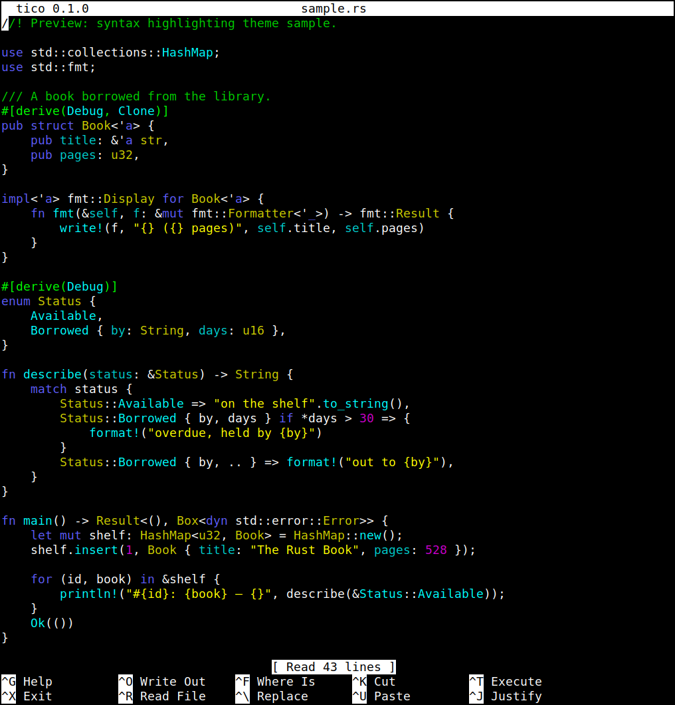
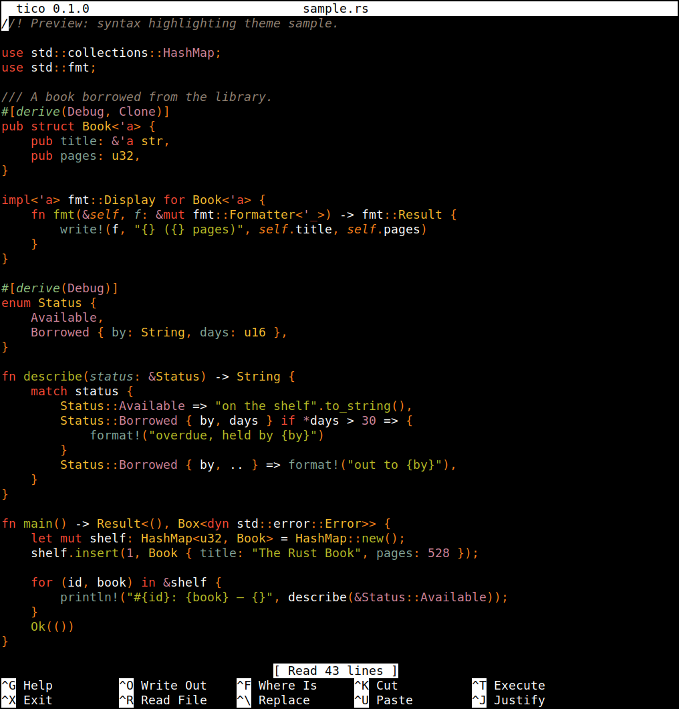
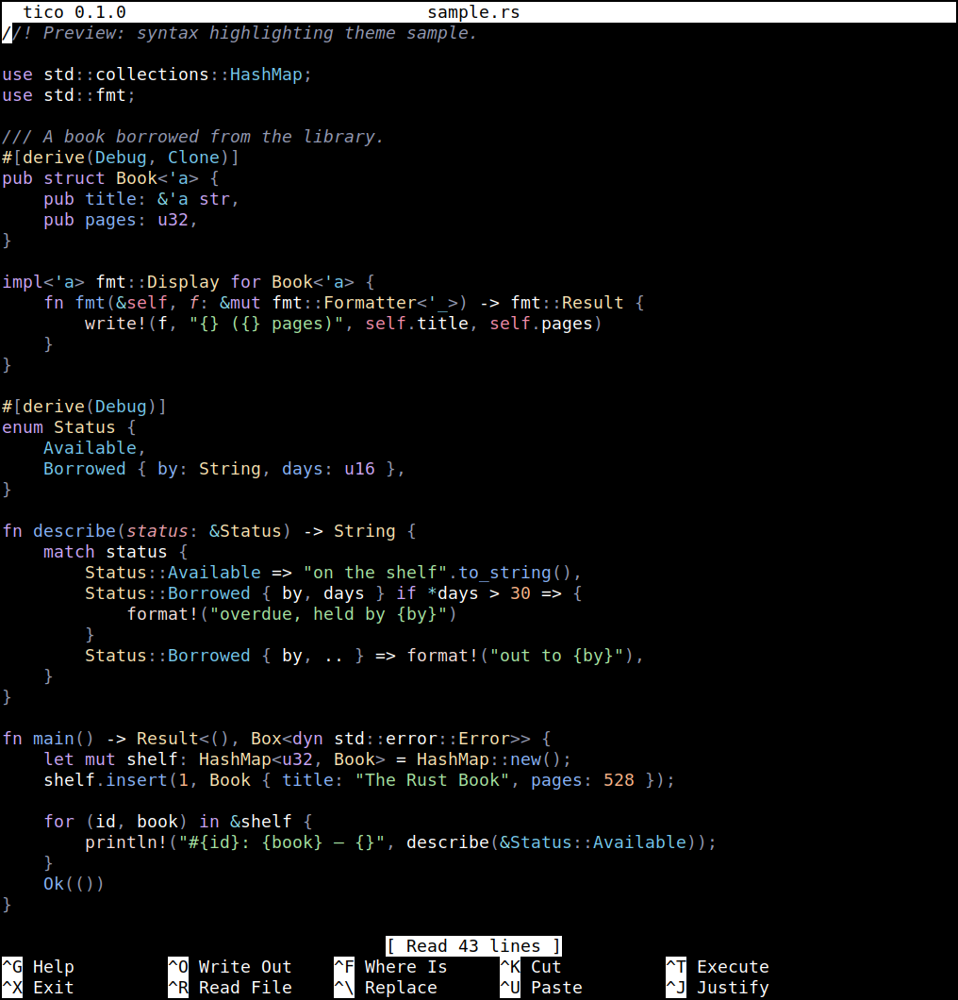
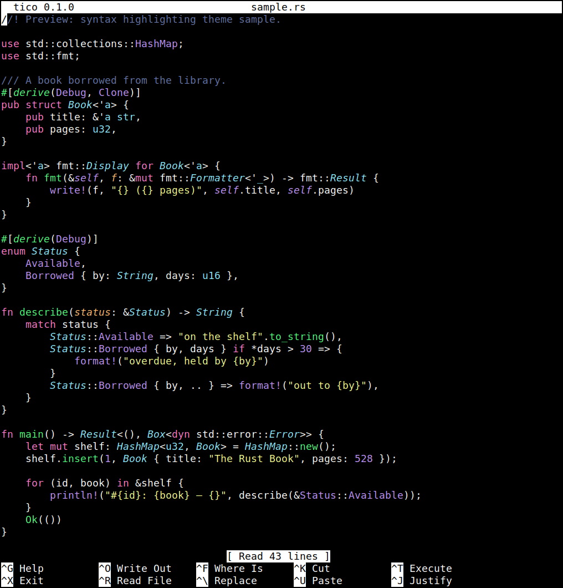
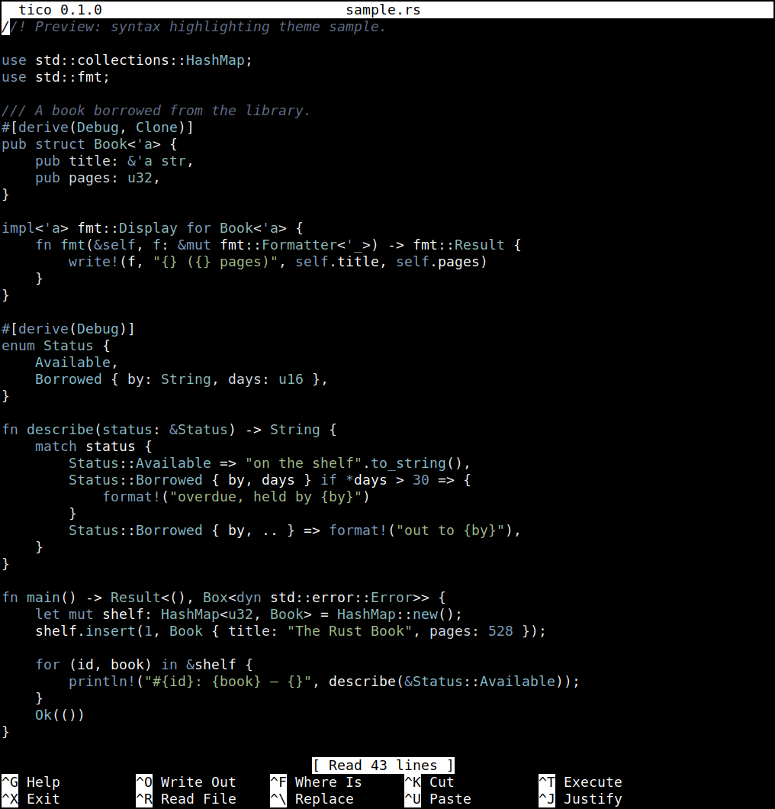
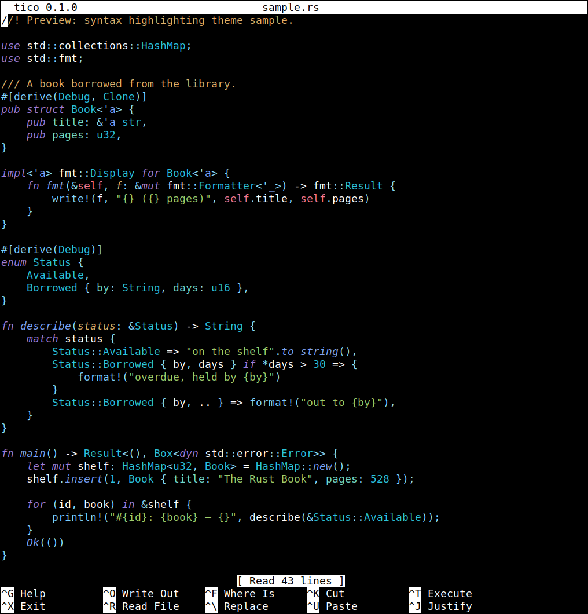
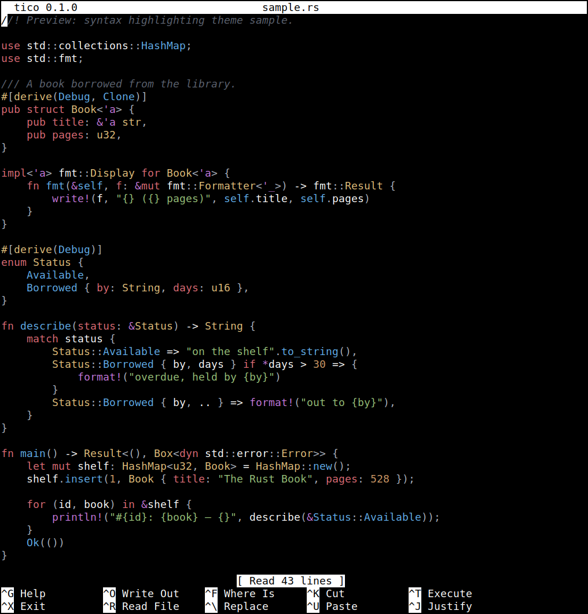
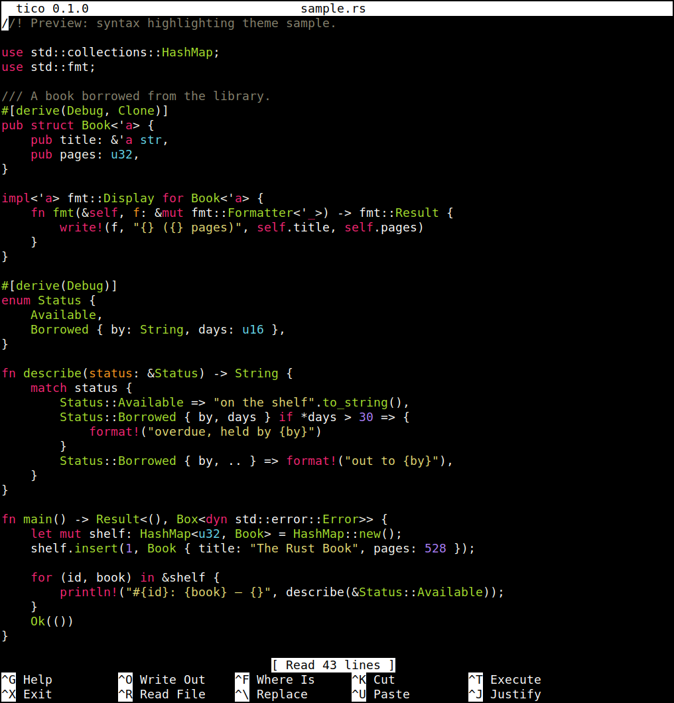
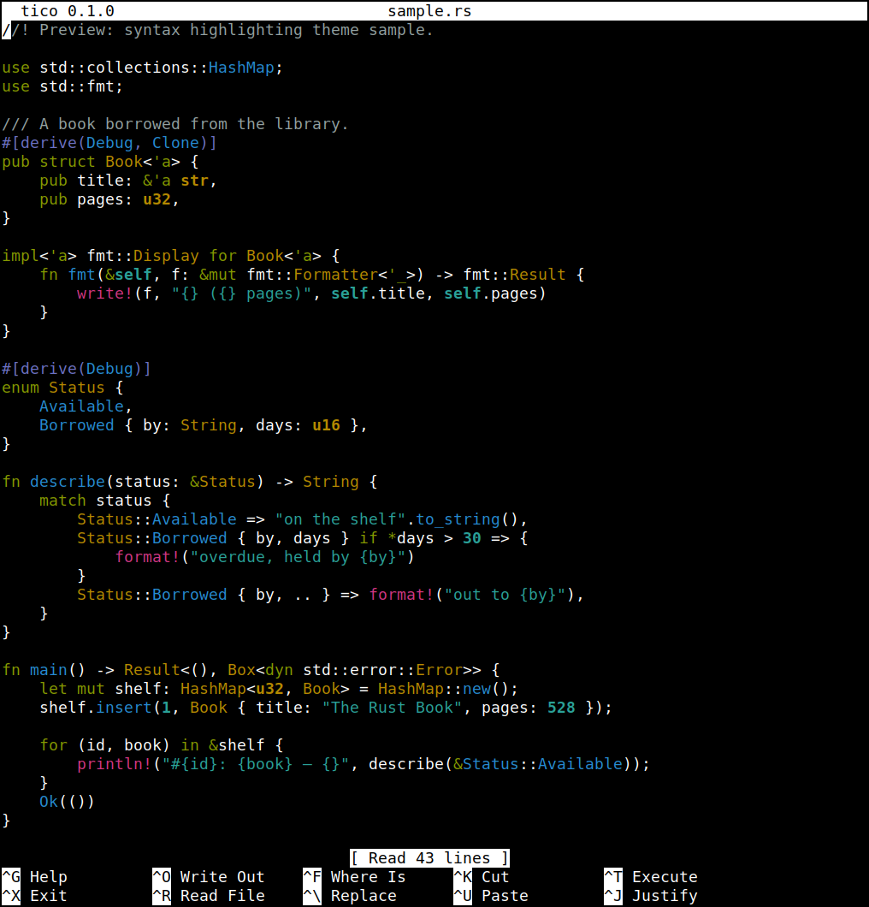

# Configuration

Tico reads up to three configuration files, in this order, each one
able to override settings from the ones before it:

1. a system-wide `nanorc`
2. a user `nanorc`
3. `~/.ticorc`, tico's own config file

Command-line flags are applied last and win over anything in any of
these files.

## nanorc: the same file nano reads

Tico understands the same file format as GNU nano's `nanorc`, so an
existing `~/.nanorc` mostly works unchanged. The full list of what a
`set`/`unset` line can name is below, in "Configuration items" — you
shouldn't need nano's own `nanorc(5)` man page just to configure tico,
though it's a reasonable deeper reference if you already know it. Tico
looks for one system-wide file and one user file:

- System-wide: `$(sysconfdir)/nanorc`, normally `/etc/nanorc`, matching
  nano's own `--sysconfdir` build option. A distro packaging tico can
  point this elsewhere at build time, or disable system-wide lookup
  entirely.
- User: the first of `~/.nanorc`, `$XDG_CONFIG_HOME/nano/nanorc` (when
  `XDG_CONFIG_HOME` is set), or `~/.config/nano/nanorc` that exists —
  the same search order nano itself uses. Only the first one found is
  read; the others are not merged in.

Both files, if present, are read every time tico starts. `set`/`unset`
lines and `bind`/`unbind` lines are applied exactly as nano applies
them.

`nanorc` also has a `syntax` block format for defining syntax
highlighting (`syntax`, `color`, `icolor`, `header`, `magic`, `include`,
`extendsyntax`, and the per-syntax `formatter`/`linter`/`comment`/
`tabgives` lines). Tico parses these — so a real-world nanorc full of
them still loads without errors — but they have no effect: tico
highlights with its own built-in, tree-sitter-based language table
instead of nano's regex engine. See "Syntax highlighting and themes"
below for how tico actually decides what to highlight and with which
colors.

Two command-line flags change how nanorc is handled:

- `-f FILE` / `--rcfile FILE` reads only that one file in place of the
  system/user nanorc search (`~/.ticorc` is still read afterward,
  unless also suppressed).
- `-I` / `--ignorercfiles` skips all of it — no nanorc, no `~/.ticorc`.

## Configuration items

This is every name a `set`/`unset` line (in a nanorc) or a bare line
(in `~/.ticorc`'s `[main]`, see below) can use, grouped by what they
affect. Most take no value — they're plain on/off toggles. A few take
one, written `set name value` in a nanorc or `name = value` in
`~/.ticorc`.

A handful are recognized and stored but don't do anything in tico yet
(no feature has been built for them). Those are marked **(not yet
implemented)** below — flipping one won't error, it just won't change
tico's behavior. Everything not marked that way works.

### Editing behavior

- `afterends` — with word-selection movement, stop at the end of a
  word instead of its start. **(not yet implemented)**
- `atblanks` — when `softwrap` is on, prefer to break lines at
  whitespace rather than mid-word. **(not yet implemented)**
- `autoindent` — indent a newly created line to match the previous
  line's leading whitespace.
- `breaklonglines` — automatically hard-wrap the current line once it
  grows past the fill column, as you type. **(not yet implemented)**
- `colonparsing` — accept a `filename:line[,column]` suffix on files
  named on the command line, to open straight to that spot. **(not yet
  implemented)**
- `cutfromcursor` — cut-line (`^K`) cuts from the cursor to the end of
  the line, instead of the whole line.
- `fill N` — the target line width for hard-wrap and justify (`^J`).
  `N` positive is an absolute column; zero or negative counts back from
  the right edge of the screen (the default, `-8`, wraps 8 columns in
  from the edge).
- `magic` — when a file's language can't be told from its name, peek at
  its content (via `libmagic`) to guess one. **(not yet implemented —
  tico's own filename/shebang/modeline/content-peek detection always
  runs regardless of this setting; see "Syntax highlighting and
  themes" below.)**
- `nonewlines` — don't keep an empty line below the text. Normally
  the buffer always ends with an empty line (the cursor can move down
  onto it, and typing there adds a fresh one below), so a saved file
  always ends with a newline, even one that was read without one. With
  this set, the text ends wherever it ends, and a file without a final
  newline is saved that way.
- `nowrap` — legacy alias for `unset breaklonglines`. **(not yet
  implemented — has no effect at all currently, including on
  `breaklonglines`)**
- `rebinddelete` — treat the Delete key as Delete even on terminals
  that report it as Backspace. **(not yet implemented)**
- `smarthome` — pressing Home moves to the first non-blank character
  first, then to column 1 on a second press.
- `softwrap` — display an overlong line across multiple screen rows
  instead of scrolling it horizontally. **(not yet implemented)**
- `tabstospaces` — convert a typed Tab into the equivalent number of
  spaces.
- `trimblanks` — trim trailing spaces from a line before hard-wrapping
  it during justify.
- `wordbounds` — a more Unix-like definition of a word boundary
  (punctuation counts as its own word) for word-wise cursor movement.
  **(not yet implemented)**
- `wordchars STRING` — extra characters (beyond letters and digits)
  that count as part of a word. Honored by word completion (`^]`): with
  `set wordchars "_"`, typing `foo` and pressing `^]` can complete to
  `foo_bar`. Word-wise movement doesn't consult it yet. **(partly
  implemented)**
- `zap` — let Backspace/Delete erase a marked selection in one go,
  instead of requiring Cut first. **(not yet implemented)**

### Search & replace

- `casesensitive` — make searches and replacements case-sensitive by
  default (still toggleable per-search with `M-C`).
- `historylog` — save search/replace/execute history to disk between
  sessions, and reload it on startup. Off in restricted mode.
- `regexp` — treat search/replace patterns as regular expressions by
  default (still toggleable per-search with `M-R`).

### Display

- `boldtext` — use bold text instead of reverse video for the title
  bar, status bar and prompts, the shortcut keys in the help lines, line
  numbers, the selection, and the `<`/`>` markers on a horizontally
  scrolled line. Anything given its own color with a `set …color` line
  keeps that color. `--boldtext` (`-D`) on the command line.
- `bookstyle` — when justifying, treat any line that starts with
  whitespace as beginning a new paragraph. **(not yet implemented)**
- `constantshow` — after every keystroke, show the cursor's position
  in the status bar, the same report `^C` gives: line, column and
  character, each out of the total and as a percentage. A message
  stays up for the keystroke that caused it, then gives way to the
  position again. With `minibar`, the minibar shows `line,column` and
  the code of the character under the cursor instead. Has no effect
  under `zero`. `--constantshow` (`-c`) on the command line; `M-C`
  toggles it (and, under `zero`, turns `zero` off).
- `emptyline` — leave the line below the title bar blank instead of
  using it for text. **(not yet implemented)**
- `guidestripe N` — draw a vertical guide bar in column `N`.
- `indicator` — show a position+portion scrollbar-style indicator
  (colored by `scrollercolor`) in the rightmost column, beside the
  text. Hidden on a screen too small for it.
- `jumpyscrolling` — scroll the view a half-screen at a time instead of
  line by line: when the cursor would leave the screen (Up/Down past an
  edge, typing or moving off it), the view re-centers on the cursor. Page
  Up/Down then start from the line on the top row and leave the cursor at
  the start of the top row, as Pico does, and Go To Line centers its line
  even near the end of the file. `-j` / `--jumpyscrolling` on the command
  line.
- `linenumbers` — show line numbers to the left of the text (colored by
  `numbercolor`).
- `matchbrackets STRING` — the brackets `M-]` (go to the matching
  bracket) recognizes: all the opening brackets first, then their
  closing partners in the same order. The default is `"(<[{)>]}"`. The
  value must not contain blanks and must have an even number of
  characters.
- `minibar` — use a single-line, minimal status bar instead of the
  full title/status bars.
- `mouse` — enable mouse support (clicking to place the cursor,
  scrolling, and so on).
- `nohelp` — don't show the two-line key-reference bar at the bottom.
- `quickblank` — clear a status-bar message on the very next keystroke,
  instead of leaving it up for a second or two.
- `rawsequences` — work around numeric-keypad key-code confusion on
  some terminals. **(not yet implemented)**
- `showcursor` — show the terminal cursor in the file browser (on the
  selected name) and in help text, where tico would otherwise hide it.
  In help text the arrow keys then move the cursor through the text,
  scrolling only when it reaches the edge, instead of scrolling the
  view line by line.
- `stateflags` — show file-state indicators (modified, DOS/Mac format,
  etc.) on the title bar. **(not yet implemented)**
- `syntax_highlighting` — tico-only, not a nano option: turn tico's own
  syntax highlighting on or off globally (on by default; also
  toggleable at runtime with `M-Y`). See "Syntax highlighting and
  themes" below.
- `tabsize N` — how many columns a tab character occupies (default
  `8`).
- `whitespace "TS"` — the two single-column characters
  `whitespacedisplay` shows in place of a tab and a space,
  respectively (default `»` and `·`).
- `whitespacedisplay` — show tabs and spaces using the `whitespace`
  characters, in the editor and at prompts (`M-P`).
- `zero` — hide every bar (title, status, help) and use the whole
  terminal for text.

### Files & safety

- `allow_insecure_backup` — when an old backup file is in the way and
  can't be deleted, overwrite it in place instead of giving up on that
  backup. Normally tico deletes any old backup and creates a brand-new
  file, so it never writes through a symlink or other file someone left
  at the backup's name.
- `backup` — before overwriting an existing file, save its previous
  contents as `NAME~` next to it (replacing any older `NAME~`). The
  backup keeps the original's permissions, timestamps and, where
  allowed, owner. If the backup can't be written there, tico tries
  your home directory instead; if that fails too, it asks whether to
  save without a backup. `-B` on the command line; `M-B` at the Write
  Out prompt turns it on or off.
- `backupdir DIR` — with `backup` on, keep backups in `DIR` instead of
  next to each file. Each one is named after the file's full path with
  every `/` turned into `!`, and numbered so earlier ones are never
  replaced (`!home!me!notes.txt~`, then `~.1`, `~.2`, …). `DIR` must be
  an existing directory, or tico refuses to start. `-C DIR` on the
  command line. Setting this alone doesn't turn backups on.
- `brackets STRING` — closing-bracket-like characters, considered
  alongside `punct` when justify decides where a sentence ends.
- `locking` — create a vim-style `.swp` lock file while a buffer is
  open, and honor other editors' lock files.
- `multibuffer` — open each file named on the command line (or read
  with `^R`) into its own buffer instead of replacing the current one.
- `noconvert` — don't convert a DOS/Mac-format file's line endings on
  read, or convert back on write; keep the bytes as-is.
- `operatingdir DIR` — confine tico to `DIR` and what's below it. Tico
  starts in `DIR` (so relative names, including those on the command
  line, are taken from there) and refuses to read a file from outside
  it ("Can't read file from outside of DIR") or write one there ("Can't
  write outside of DIR"). The file browser and Tab completion stay
  inside too, and `^R` says `[from DIR]`. A `DIR` that isn't an
  existing directory stops tico from starting. `-o DIR` /
  `--operatingdir DIR` on the command line; in restricted mode, only
  the command-line one counts.
- `positionlog` — remember where the cursor was when you closed each
  file, and put it back there the next time you open that file (from
  the command line, or with `^R` into a new buffer). A `+LINE` on the
  command line takes precedence. The last 200 files are kept in
  `filepos_history` in nano's state directory (`~/.nano/` if that
  exists, else `$XDG_DATA_HOME/nano/` or `~/.local/share/nano/`), in
  nano's own format, so tico and nano share it. Off in restricted mode.
  `-P` / `--positionlog` on the command line.
- `preserve` — leave the terminal's XON/XOFF flow control on, so `^S`
  stops the terminal's output and `^Q` resumes it, instead of tico
  receiving them as keys (they can still be typed with `M-V`). `-p` /
  `--preserve` on the command line also unbinds tico's own default `^S`
  (Save) and `^Q` (search backward; Discard Buffer at the Write Out
  prompt), as nano does; with `set preserve` they stay bound, though the
  terminal gets them first. Ignored with `--modernbindings`, which needs
  `^Q` and `^S`. Has no effect on Windows, whose console has no flow
  control.
- `punct STRING` — characters that count as sentence-ending
  punctuation for justify (default `!.?`), consulted together with
  `brackets`.
- `quotestr REGEX` — the regular expression that identifies a quoted
  line's prefix (e.g. `> `) when justifying quoted text.
- `restricted` — not a nanorc setting (as in nano): restricted mode is
  turned on with `-R` / `--restricted`, or by running tico under a name
  that starts with `r` (like nano's `rnano`). Tico then touches only
  the files named on the command line. Read File (`^R`), Execute
  (`^T`), suspending, the spell checker, linter and formatter all say
  "This function is disabled in restricted mode". At the Write Out
  prompt a named buffer's name can't be changed, an unnamed one can't
  overwrite an existing file, a selection isn't written on its own,
  and Append, Prepend, Backup File and Browse are gone. Tab completion
  is off, `backup`, `historylog` and `positionlog` are off, a nanorc
  `operatingdir` is ignored, and the title bar says "Restricted" until
  the buffer is modified.
- `saveonexit` — save changes on exit without asking.
- `speller PROGRAM` — use `PROGRAM` as the spell checker (`^T`) instead
  of the built-in one.
- `unix` — save a new file in Unix format by default, regardless of
  what format it was read in.

### Colors

Twelve options each set the color of one piece of the interface. All
share the same value syntax: `[bold,][italic,]fgcolor[,bgcolor]` — one
or two color names (or hex, `#rgb`), optionally preceded by `bold`
and/or `italic`. Color names are the eight ANSI names (`black`, `red`,
`green`, `yellow`, `blue`, `magenta`, `cyan`, `white`), each optionally
prefixed `light` for the bright variant, plus `normal` for the
terminal's default, and — on a terminal with at least 256 colors — a
set of named hues (`pink`, `purple`, `mauve`, `lagoon`, `mint`, `lime`,
`peach`, `orange`, `latte`, `rosy`, `beet`, `plum`, `sea`, `sky`,
`slate`, `teal`, `sage`, `brown`, `ocher`, `sand`, `tawny`, `brick`,
`crimson`). Example: `set titlecolor bold,white,blue`.

- `errorcolor` — error messages in the status area. Defaults to bold
  white on red.
- `functioncolor` — a key's description in the help/key-reference bars
  (the part next to the key itself). Unstyled (plain) by default.
- `keycolor` — a key combo's name in the help/key-reference bars.
  Reverse video by default.
- `minicolor` — the single-line bar used by `minibar`. Falls back to
  `titlecolor`'s colors (like `promptcolor`) when unset.
- `numbercolor` — line numbers (`linenumbers`). Reverse video by
  default.
- `promptcolor` — the prompt bar shown while typing a search, filename,
  etc. Falls back to `titlecolor`'s colors when unset.
- `scrollercolor` — the position+portion indicator (`indicator`). Its
  track is unstyled by default; the thumb is always additionally
  reverse-video.
- `selectedcolor` — selected (marked) text, and the selected name in
  the file browser. Reverse video by default.
- `spotlightcolor` — the current search match. Defaults to black on
  light yellow.
- `statuscolor` — ordinary (non-error) status-bar messages.
- `stripecolor` — the vertical guide bar (`guidestripe`). Reverse video
  by default.
- `titlecolor` — the title bar. Reverse video by default; every other
  bar's default styling is ultimately derived from this one.

## `~/.ticorc`: tico's own config file

Tico adds one more file with no nano equivalent: `~/.ticorc` (or
`$XDG_CONFIG_HOME/tico/ticorc`, if that already exists). Its settings
take precedence over anything set in a nanorc. It's an INI-style file
with up to four sections.

### `[main]`

The same options as "Configuration items" above, just written without
the leading `set`/`unset` keyword — a bare `optionname` (or
`optionname = value`) turns it on, and `unset optionname` turns it off:

```ini
[main]
linenumbers
tabstospaces
tabsize = 4
unset mouse
```

### `[keybindings]`

Rebinds keys without nano's `bind`/`unbind` syntax. Each line is
`[menu.]key = function`; `menu` defaults to `main` if omitted. A
quoted value binds the key to that literal string (a macro) instead of
a named function. `key = unbind` (or `= none`) removes a binding.

```ini
[keybindings]
^G = help
search.^Y = older
^D = "some literal text"
^K = unbind
```

### `[syntax]`

Picks which color theme tico's syntax highlighter uses — nothing to do
with nanorc's `color`/`icolor` directives, which tico ignores (see
"Syntax highlighting and themes" below). `theme = NAME` sets the
theme for every language; `LANGUAGE.theme = NAME` overrides it for one
language only (language names as listed by `--listsyntaxes`):

```ini
[syntax]
theme = tico-builtin-gruvbox
perl.theme = tico-builtin-nord
fortran.theme = "~/my-themes/retro.toml"
```

### `[tico]`

Settings with no nano equivalent at all. Currently just one:

- `max_syntax_highlight_size` — files larger than this are opened
  without syntax highlighting (to keep large files fast). Accepts a
  plain byte count or a `KB`/`MB`/`GB`-suffixed size, e.g.
  `max_syntax_highlight_size = 8MB`.

```ini
[tico]
max_syntax_highlight_size = 8MB
```

## Syntax highlighting and themes

This is the one area where tico deliberately does not behave like
nano. nano highlights by matching regular expressions defined in
nanorc `syntax`/`color`/`icolor` blocks. Tico instead ships its own
built-in table of languages, each backed by a tree-sitter grammar, and
detects a buffer's language from its filename, shebang, or a modeline
— not from anything in a nanorc. There is currently no way to add
highlighting for a language tico doesn't already know, short of adding
a grammar to tico itself.

Colors, however, are configurable: they come from a theme file in
[Helix](https://helix-editor.com/)'s theme format — plain TOML, keyed
by scope names like `keyword.control.import` or `constant.numeric`.
Only a theme's syntax-scope entries are used; a theme's `ui.*` entries
(for things like the status bar or selection color) are ignored, since
those follow nano's own `set titlecolor` and similar options instead.

Tico has nine themes built in, all named with a `tico-builtin-` prefix
(reserved: a name starting with it is never looked for on disk, so it
can't be shadowed by a same-named file elsewhere):

- `tico-builtin-default` — tico's own 16-color theme, with no
  backgrounds, taking its colors from the terminal's palette. The
  right choice on a terminal that doesn't support truecolor.
- `tico-builtin-gruvbox` — warm, retro, earthy dark.
- `tico-builtin-catppuccin_mocha` — soft pastel dark.
- `tico-builtin-dracula` — purple/pink, high-saturation dark.
- `tico-builtin-nord` — cool, muted "arctic" blue dark.
- `tico-builtin-tokyonight` — deep night-blue with violet accents.
- `tico-builtin-onedark` — the classic Atom "One Dark".
- `tico-builtin-monokai` — high-contrast green/yellow/pink (Sublime's
  classic).
- `tico-builtin-solarized_light` — the one light-background theme.

All eight non-default themes are vendored unmodified from Helix and use
truecolor (`#rrggbb`), so they need a terminal that supports it.

### Screenshots

Each built-in theme, highlighting the same sample of Rust code, with
tico's default title bar and two-line help footer. Note
`tico-builtin-solarized_light`'s colors are calibrated for a light
background, but tico takes the background itself from the terminal —
that's the `ui.*`-is-ignored rule above in practice.

**`tico-builtin-default`**



**`tico-builtin-gruvbox`**



**`tico-builtin-catppuccin_mocha`**



**`tico-builtin-dracula`**



**`tico-builtin-nord`**



**`tico-builtin-tokyonight`**



**`tico-builtin-onedark`**



**`tico-builtin-monokai`**



**`tico-builtin-solarized_light`**



Any other name is looked up on disk, in order:

1. `$XDG_CONFIG_HOME/tico/themes/` (normally `~/.config/tico/themes/`)
2. `$XDG_CONFIG_HOME/helix/themes/`, then `$HELIX_RUNTIME/themes/` if
   `HELIX_RUNTIME` is set
3. wherever an installed Helix keeps its ~70 bundled themes
   (`/usr/share/helix/runtime/themes` and similar system paths)

so any theme already installed for Helix works for tico too, unmodified.

The theme is chosen with `[syntax]`'s `theme`/`LANGUAGE.theme` in
`~/.ticorc` (above), or overridden from the command line with
`--tico-theme NAME` (global) or `--tico-theme LANGUAGE.NAME` (one
language only) — either flag can be repeated. `--tico-list-themes`
prints every built-in and on-disk theme it can find, along with a
summary of which theme applies to what in the current configuration.

## Precedence, summarized

Later wins over earlier:

1. system nanorc
2. user nanorc (`~/.nanorc` or equivalent — `-f`/`--rcfile` replaces
   both of the above with a single named file)
3. `~/.ticorc`
4. command-line flags

`-I`/`--ignorercfiles` skips 1–3 entirely and runs on defaults plus
whatever's on the command line.
