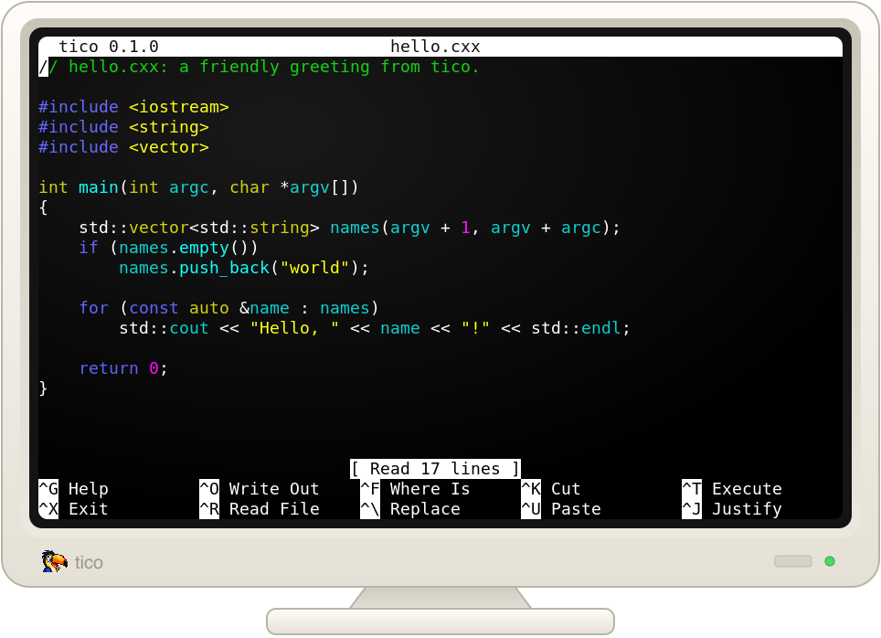

# tico

## A friendly editor for the terminal

**tico** is a small, easy-to-use terminal text editor for people who
want to edit a file and get on with what they were doing.

If you already know **nano**, tico should feel familiar immediately.
Common commands and key bindings follow nano conventions, so your muscle
memory comes with you. Tico also understands nano-style configuration,
making it easy to bring an existing setup along rather than learning a
new editor from scratch.

### Syntax highlighting without the regex archaeology

Tico includes syntax highlighting for common programming and markup
languages out of the box, including **Perl, C, C++, HTML, and INI**.

Highlighting is syntax-aware rather than a collection of regular
expressions you have to maintain yourself. That's particularly useful
for dynamic languages such as Perl, where strings, quote-like operators,
regular expressions, heredocs, and embedded languages can make
regex-based highlighting complicated and fragile.

Tico handles that for you. Open a Perl file and it looks like Perl.

It can even recognize embedded languages---for example, SQL inside a
Perl heredoc can be highlighted as SQL.

### Familiar by design

Tico isn't trying to turn text editing into a new skill to master. It's
meant to provide the straightforward experience that makes nano useful,
while adding the features you'd expect from a modern source-code editor.

If you know nano, you already know how to use tico.
